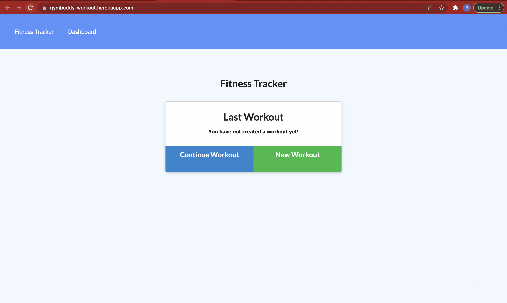

# gym_buddy_workout_tracker

 

## Description
This application allows users to keep track of their workouts. The application will display a summary of graphs of all the user's completed workouts within that week. The technologies that will be used is MongoDB with Mongoose schema and handle routes with Express.  


## Table of Contents 🔎
- [Installation](#installation)
- [Demo](#demo)
 -[GitHub & Deploy Link](#githubdeploylink)
- [Contributers](#contributers)
- [Resources & Tutorials](#resources&tutorials)
- [License](#license)

### Installation  💾
 The application will be invoked by using the following command:

```bash
  npm install 
``` 
```bash
  npm start
```


### Demo 🎥



### GitHub & Heroku Link

* [GitHub Link](https://github.com/bperez05/gym_buddy_workout_tracker)
* [Heroku Link](https://gymbuddy-workout.herokuapp.com/)

## Contributers
*Brandon Perez

## Resources & Tutorials  💻
* [MongoDB documentation on the $addFields](https://docs.mongodb.com/manual/reference/operator/aggregation/addFields/)
* [MongoDB documentation on the $sum operator](https://docs.mongodb.com/manual/reference/operator/aggregation/sum/)
* [Mongoose documentation on aggregate functions](https://mongoosejs.com/docs/api.html#aggregate_Aggregate)


## MIT License 📍
Copyright (c) 2021 Brandon Perez

Permission is hereby granted, free of charge, to any person obtaining a copy
of this software and associated documentation files (the "Software"), to deal
in the Software without restriction, including without limitation the rights
to use, copy, modify, merge, publish, distribute, sublicense, and/or sell
copies of the Software, and to permit persons to whom the Software is
furnished to do so, subject to the following conditions:

The above copyright notice and this permission notice shall be included in all
copies or substantial portions of the Software.

THE SOFTWARE IS PROVIDED "AS IS", WITHOUT WARRANTY OF ANY KIND, EXPRESS OR
IMPLIED, INCLUDING BUT NOT LIMITED TO THE WARRANTIES OF MERCHANTABILITY,
FITNESS FOR A PARTICULAR PURPOSE AND NONINFRINGEMENT. IN NO EVENT SHALL THE
AUTHORS OR COPYRIGHT HOLDERS BE LIABLE FOR ANY CLAIM, DAMAGES OR OTHER
LIABILITY, WHETHER IN AN ACTION OF CONTRACT, TORT OR OTHERWISE, ARISING FROM,
OUT OF OR IN CONNECTION WITH THE SOFTWARE OR THE USE OR OTHER DEALINGS IN THE
SOFTWARE.

